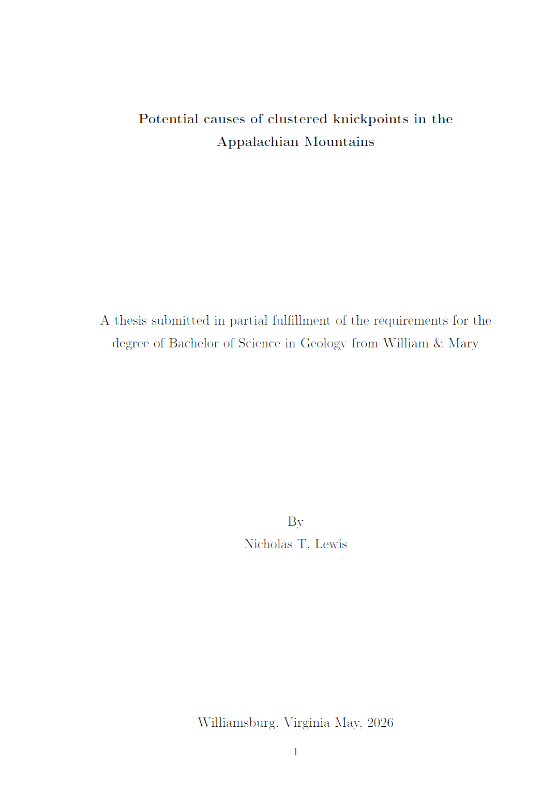
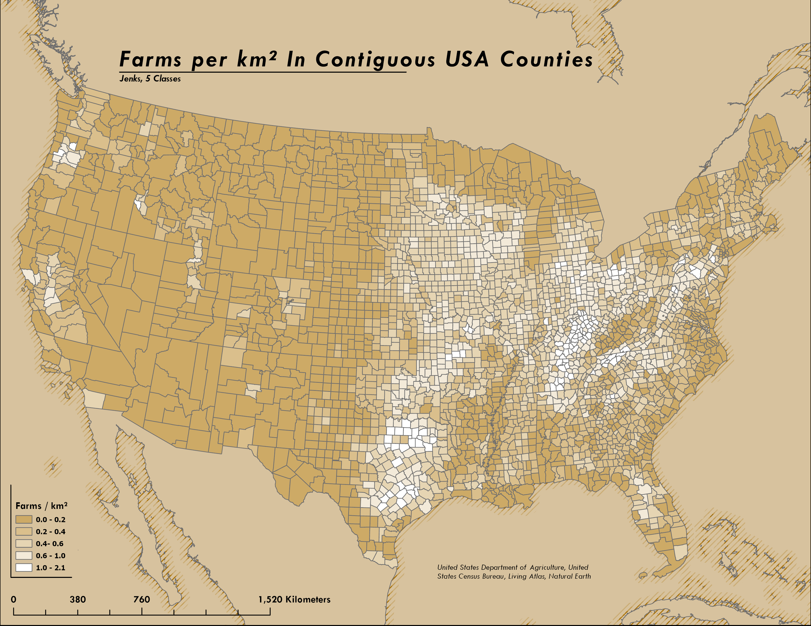
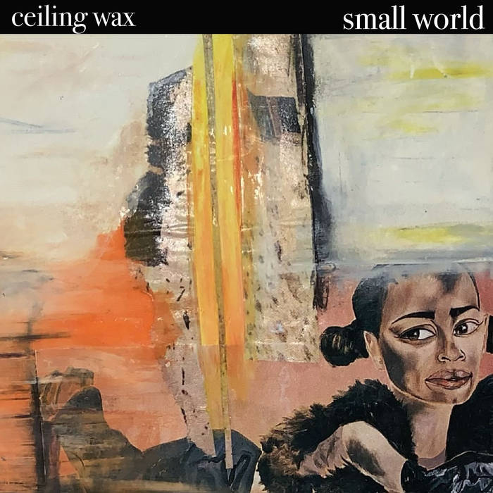

::: {.hero}

::: {.hero-overlay}

{.profile-pic}

# Nick Lewis

Geomorphologist / GIS Analyst  
Leveraging field and computational research experience for data-driven analysis.
ntompkinslew@gmail.com | [GitHub](https://github.com/ntlewis1251) | [LinkedIn](https://www.linkedin.com/in/nick-lewis-geo/) | (757) 667-8823

:::
:::

---

## About me

::: {.blurb}

:::: {.columns}

::: {.column width="50%"}
### Geology, coding, and data science.

For the last 2 years, I have been working with [Joanmarie Del Vecchio](https://www.wm.edu/as/geology/people/faculty/delvecchio_j.php) and [Chuck Bailey](https://www.wm.edu/as/geology/people/faculty/bailey_c.php) on an honors thesis in the geology department at William & Mary: Potential causes of clustered knickpoints in the Appalachians.  The study entailed raster analysis, data management, scientific writing, proposal writing, and figure making.
:::

::: {.column width="50%"}

:::

::::

:::

---

::: {.blurb}

:::: {.columns}

::: {.column width="50%"}

:::

::: {.column width="50%"}
### Passion for cartography

I find great enjoyement in creating visually pleasing and artistic mpas that display data in pragmatic, clear ways.
:::

::::

:::

---

::: {.blurb}

:::: {.columns}

::: {.column width="50%"}
### Music

When im not working, I make bad rock music [here](https://ceilingwax.bandcamp.com/album/small-world-demos).
:::

::: {.column width="50%"}

:::

::::

:::

---

## Latest Insight

:::{#latest-post}
:::