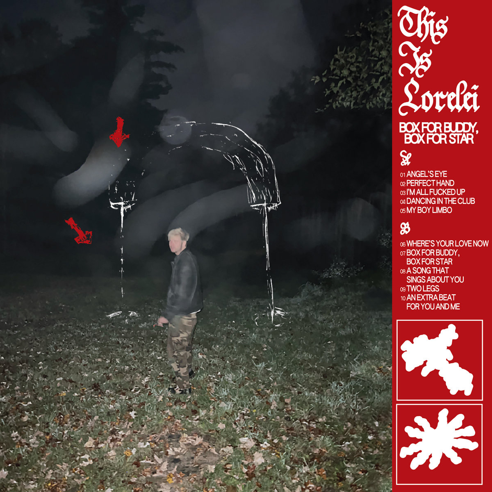
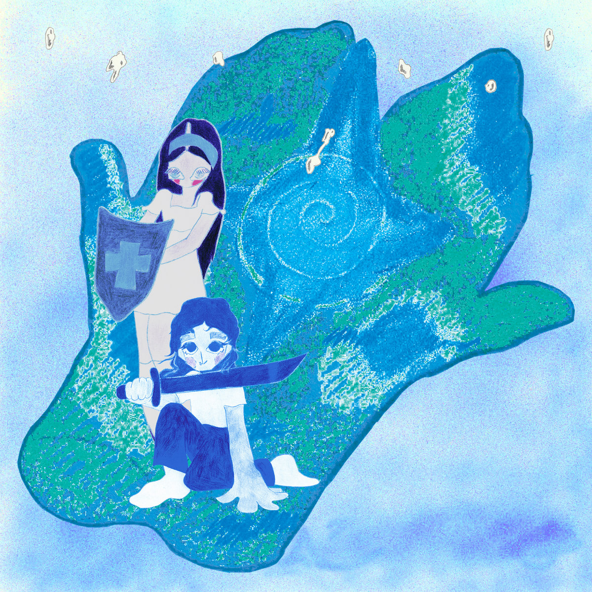
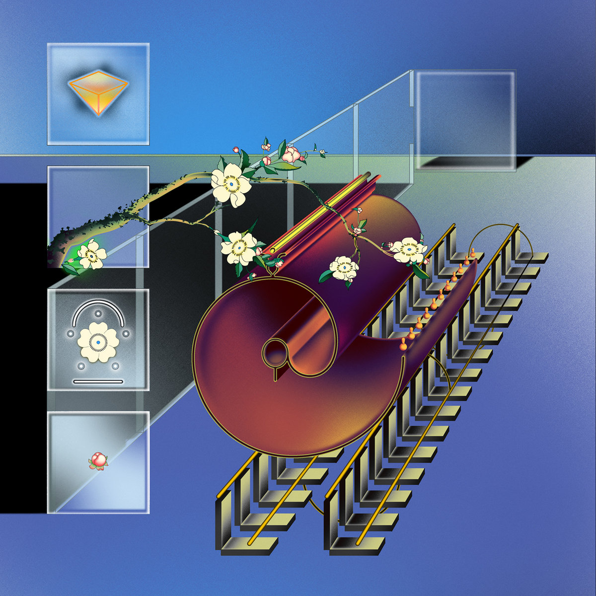

**The indie pop scene** is often intertwined, and to understand one band, you often must know another.

---

::: {.blurb}

:::: {.columns}

::: {.column width="50%"}
# This is Lorelei
Is the solo project of Nate Amos.  He is more well-known as one half of the pop duo, "Water From Your Eyes", 
    where he makes explorative pop with an electronica-laced rock edge alongside Rachel Brown of 'thanks for coming'.
:::

::: {.column width="50%"}

:::

::::

:::
---

This is Lorelie's music is often simple and repetetive.  This is meant in the best of ways.  A catchy pop hook is never too far off.  
    Box for Buddy, Box for Star's "Dancing in the Club" uses card ranks to paint a beautiful and bitter picture of love lost.  
    "I'm all Fucked Up" follows in the tradition of this album's singles' simple pop hooks and repetetive verses, bringing a formula closer to perfection.
    Songs like "Where's Your Love Now" and "Angel's Eye" explore genre-bending instrumentation without breaking the set pattern.

::: {.blurb}

:::: {.columns}

::: {.column width="50%"}

:::

::: {.column width="50%"}
# Fantasy of a Broken Heart
Is a pop duo comprised of This is Lorelei's live backing band, Al Nardo (drums, guitar) and Bailey Wollowitz (bass, guitar).  They craft pulp fantasy-laced
    pop soundscapes that entrance and often befuddle.
:::

::::

:::

---

With only one LP to their name, it may be difficult to objectively describe FOABH's music.  With semi-straightfoward rock bangers such as "AFV" and 
    "Your Heart Stops" being followed by the strange orchestral, spoken word arrangements of songs like "Fantasy of a Broken Heart", it is hard to 
    pin them down to one sound.  Wollowitz's baritone makes cameos across several songs in an over-exagerated spoken croon to drop such lines as 
    "on beautiful Saturdays, Tony Danza makes me buttermilk pancakes in the moring."  Their choruses are often incessant pop hooks that leave you 
    begging for just one more verse-chorus-bridge run-around.

::: {.blurb}

:::: {.columns}

::: {.column width="50%"}
# @
Is the hard-to-google-search hyper-folk duo comprised of Victoria Rose and Stone Filipczak.  The duo deliver fantastical folk songs with 
    non-traditional structure and composition.  They often open for and play with both of the above bands, creating a scene of their own.
:::

::: {.column width="50%"}

:::

::::

:::

---

Their only LP, "Mind Palace Music" is a magical record filled with flute lines, dissonant harmonies, and skilled guitar playing.  The record reflects its
    unusual production.  The duo rarely worked together in person, instead opting for iMessages of voice memos and logic pro files. The intricate bass
    and sparse drums let the beautifully crafted guitar lines and unusual instrumentation shine, as well as Rose's lilting voice.  Filipczak makes his
    debut on "Friendship is Frequency", a standout track not for its unusual nature, rather for its seemingly normal structure on an album filled With
    twists and turns in every track.  His whining tenor strangely compliments Rose's more airy vocals, a chemistry best seen on the final track "My Garden"
    For such an ambitious album, it is amazing that it only has one stinker, "Camera Phone".  Maybe to a more sophisticated listener, this is the best track
    on the album.  I am not a sophisticated listener.